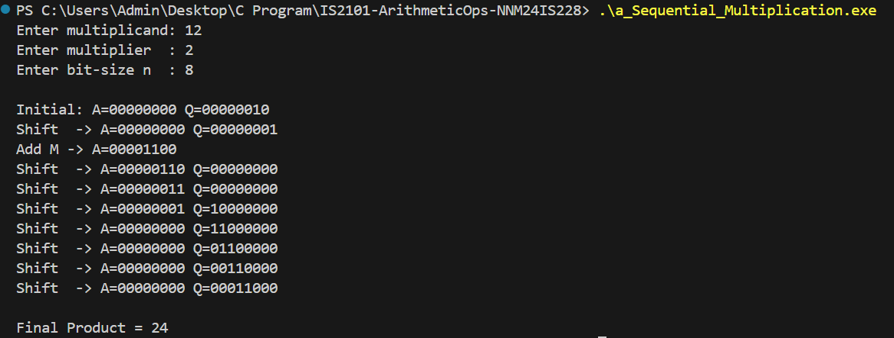
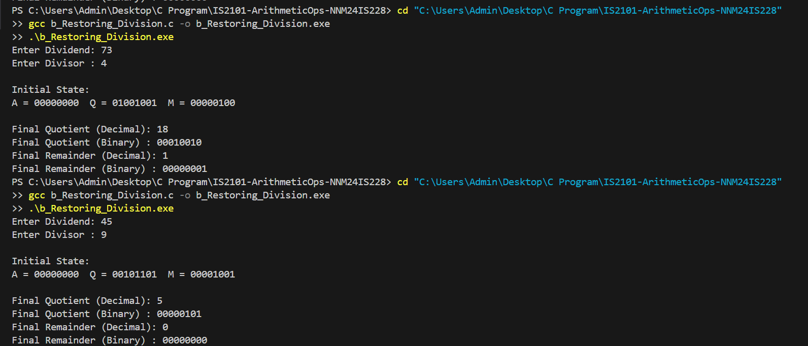
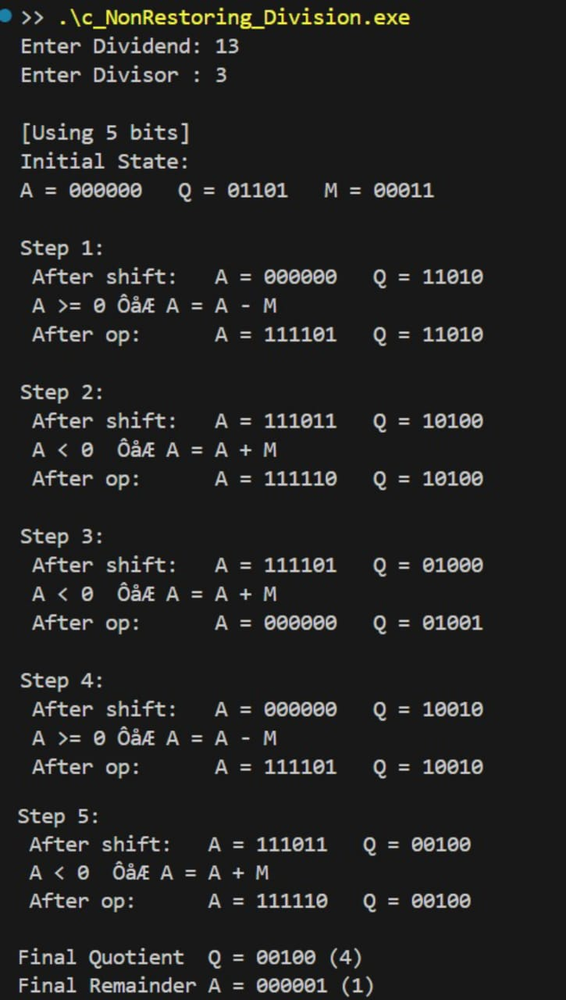

# IS2101 - Arithmetic Operations in C

This project contains three C programs that implement fundamental binary arithmetic algorithms: **Sequential Multiplication**, **Restoring Division**, and **Non-Restoring Division**. Each program demonstrates the step-by-step process of these operations, providing a clear visual representation of how they work at a low level.

-----

## 📂 Folder Structure

The repository has the following file and folder structure:

```
IS2101-ArithmeticOps-NNM24IS228/
│── a_Sequential_Multiplication.c
│── b_Restoring_Division.c
│── c_NonRestoring_Division.c
│── Output/
│ ├── SequentialMultiplication_output.png
│ ├── RestoringDivision_output.png
│ └── NonRestoringDivision_output.jpeg
│── README.md
```

-----

## ⚙️ Compilation & Execution

To compile and run the programs, you'll need a C compiler like GCC. You can use the following commands in your terminal.

### 1\. Sequential Multiplication

  * **Compile:** `gcc a_Sequential_Multiplication.c -o a_Sequential_Multiplication.exe`
  * **Execute:** `.\a_Sequential_Multiplication.exe`

### 2\. Restoring Division

  * **Compile:** `gcc b_Restoring_Division.c -o b_Restoring_Division.exe`
  * **Execute:** `.\b_Restoring_Division.exe`

### 3\. Non-Restoring Division

  * **Compile:** `gcc c_NonRestoring_Division.c -o c_NonRestoring_Division.exe`
  * **Execute:** `.\c_NonRestoring_Division.exe`

-----

## 📥 Inputs & 📤 Outputs

Each program requires specific inputs and produces a detailed output of the operation.

### 1\. Sequential Multiplication

  * **Inputs:** Multiplicand, Multiplier, and Bit-size.
  * **Output:**

### 2\. Restoring Division

  * **Inputs:** Dividend and Divisor.
  * **Output:**

### 3\. Non-Restoring Division

  * **Inputs:** Dividend and Divisor.
  * **Output:**
    

-----

## ✅ Sample Results

Here are some sample results from running the programs with specific inputs:

  * **Non-Restoring Division:** `13 ÷ 3` results in a Quotient of `4` and a Remainder of `1`.
  * **Restoring Division:** `73 ÷ 4` results in a Quotient of `18` and a Remainder of `1`.
  * **Sequential Multiplication:** `12 × 2` results in a Product of `24`.
